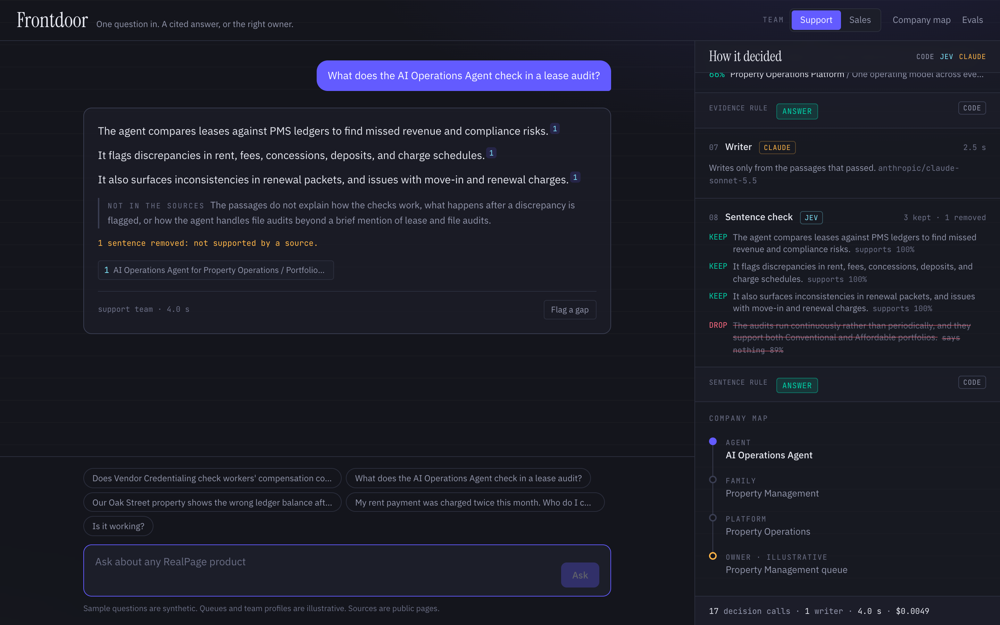
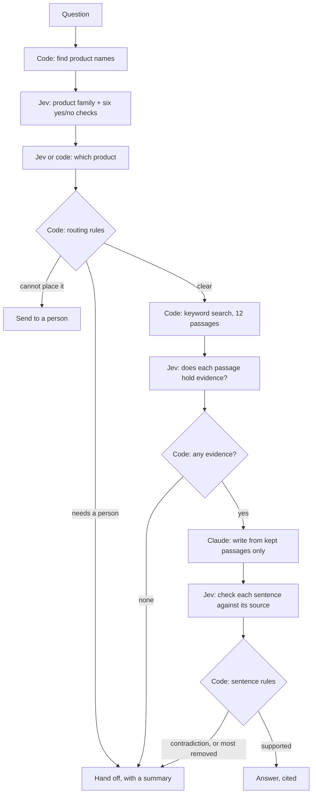

# Frontdoor

One question in. A cited answer, or the right owner.

Frontdoor is a company knowledge layer and an assistant on top of it. Ask about any product. It answers only from sources it can cite. When it should not answer, it says who should, and passes along what it found. Every decision it makes is shown beside the answer.

It was built in one day from RealPage's public website, as a small version of a pattern I run in production: build the foundation once, then add teams one at a time.



## What it does

| You ask | It does |
|---|---|
| How a product works | Finds passages, keeps the ones that hold evidence, writes from those, then checks each sentence against its source |
| Something that needs account records, a price, or a person | Hands off to the owning queue with a summary |
| Something it cannot place | Sends it to a person, and says why |

While you type, the first routing decision runs on every pause, before you send.

## How it works



Three jobs, three owners:

| Job | Owner |
|---|---|
| Rules, lookups, search | Code. Every outcome is unit tested. |
| Judgments, each with a probability | [Jev](https://docs.typesafe.ai), a decision model |
| Writing | Claude, only from passages that passed |

Both models are reached through OpenRouter with one key.

## The four layers

| Layer | In this repo |
|---|---|
| Teams | `teams/*.json`. Two profiles on one core. Adding a team is adding a file. |
| Agent core | `src/lib/pipeline.ts`, with the rules in `src/lib/gate.ts` |
| Knowledge layer | `knowledge/`: 157 markdown files. Plus a passage index built at startup. |
| Connector | `ingest/`: reads 221 public pages from the site's sitemaps and menu |

## Results

Scored by code against written expectations. No model grades its own work.

| Run | Questions | Did the right thing |
|---|---|---|
| Held-out, run once | 10 | **9 of 10** |
| Tuning, first draft | 30 | 28 of 30 |
| Tuning, second draft | 30 | 29 of 30 |
| Tuning, third draft | 30 | 30 of 30 |

- **Quote the held-out number.** Those questions were written after tuning stopped, committed before their first run, and run once. The tuning set is what the system was adjusted against.
- **Never answered out of turn.** Across the 16 questions that needed a person, it answered none.
- **The miss.** A question about published customer results was sent to a person when it could have been answered.
- **Speed and cost on the held-out run.** Median 4.9 seconds to an answer, under a second for a handoff, about $0.004 per question.

Every change between drafts, and why, is in [docs/iteration-log.md](docs/iteration-log.md). Result files are in [evals/results/](evals/results/).

### What these numbers do not show

- Forty questions is a small set. One question is 2.5 points.
- I wrote the questions and the expectations.
- Most tuning questions name a product outright, which code catches without a model.
- Runs vary. The same setup scored 28, then 30, on two consecutive runs.

## Choices

Each is written up in [docs/decisions.md](docs/decisions.md), with the alternatives and when each one is the right call.

| Choice | Chosen | Why |
|---|---|---|
| Retrieval | Keyword search plus an evidence check | 1,323 passages. It found the right page for every answerable question where a search ran. |
| Knowledge store | Markdown files in the Open Knowledge Format | 157 entities. People can read and correct them, and git keeps the history. |
| Structure | Read from the site's own menu | Never guessed. Where the menu is silent, Jev decides and its confidence is written on the file. |
| Handoff summary | Built by code | It cannot say anything the trace does not show. |

## Run it

Needs Node 22, pnpm, and an OpenRouter key.

```bash
pnpm install
cp .env.example .env.local   # then add your OpenRouter key
pnpm ingest                  # reads the public pages, about 4 minutes
pnpm dev --port 3210
```

Other commands:

| Command | What it does |
|---|---|
| `pnpm ask "question" [team]` | Runs one question and prints the trace |
| `pnpm test` | 35 unit tests: rules, map, teams, search |
| `pnpm eval --set golden --questions v3` | Runs a test set and saves the results |
| `pnpm knowledge:build` | Rebuilds the company map from the crawled pages |
| `pnpm knowledge:lint` | Checks fields, links, and family placement |
| `pnpm deck` | Builds `deck/frontdoor.pptx` from the result files |

The crawler sends one request per second, identifies itself, and follows `robots.txt`.

## What is in git, and what is not

- **In git:** the crawler, the list of URLs, and the company map. Map descriptions are written in our own words, each with a link to its source.
- **Not in git:** the pages themselves. `pnpm ingest` fetches them again.

## What is illustrative

- **Queues and team profiles.** RealPage's internal team structure is not public. These are stand-ins, labeled as such in the files and on screen.
- **Sample questions.** Synthetic.

## What this does not claim

- Any knowledge of RealPage's internal systems.
- That this is multi-agent, or that it uses a vector database or an agent framework. It is one pipeline with plain code between the steps.
- That it is production ready. It has no sign-in, no rate limiting, and no monitoring.

## Layout

```
ingest/      crawl, clean, read the site menu
knowledge/   the company map (OKF)
teams/       team profiles
src/lib/     openrouter, okf, search, gate, pipeline, teams, questions/
src/app/     chat, company map page, evals page, API routes
scripts/     build-knowledge, lint-knowledge, eval, ask, build-deck, shots
evals/       test sets and results
docs/        decisions and the iteration log
deck/        slides, talk track, demo script
tests/       unit tests
```

Not affiliated with RealPage. Built from public pages by [Hamza Saraswat](https://hamza-saraswat.com).
